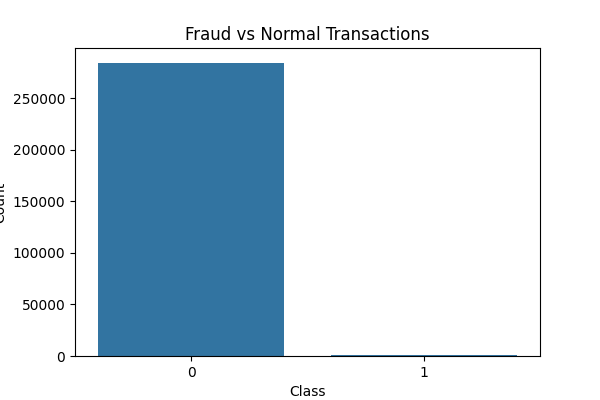
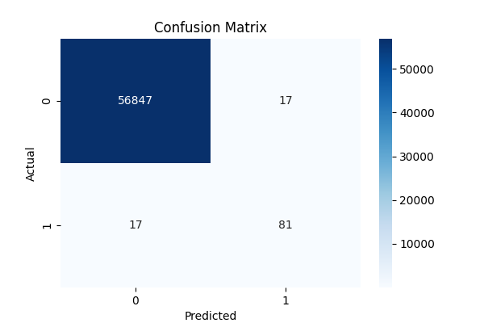
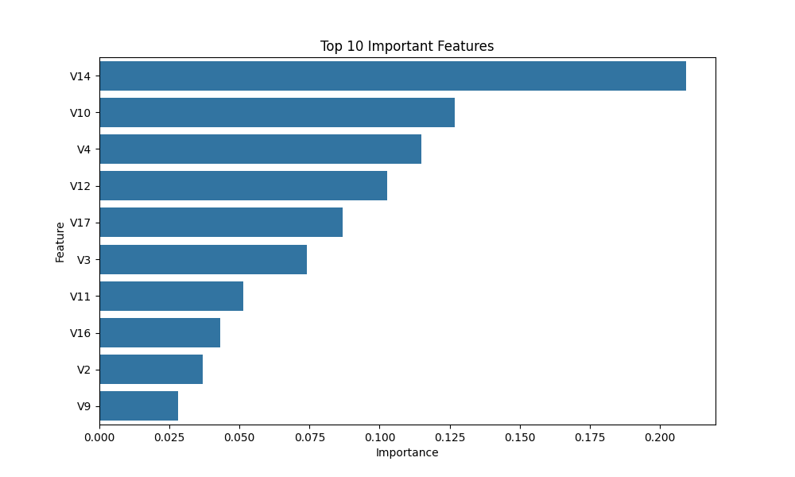

\# Credit Card Fraud Detection System


\## Overview


This project is an end-to-end Machine Learning system that detects fraudulent credit card transactions using classification algorithms and imbalance-handling techniques.


The project uses:


\* Python

\* Scikit-learn

\* Random Forest

\* SMOTE

\* FastAPI

\* Pandas

\* Matplotlib

\* Seaborn


\---


\## Problem Statement


Credit card fraud is one of the major challenges faced by banks and fintech companies. Fraudulent transactions are very rare compared to normal transactions, making fraud detection a highly imbalanced classification problem.


This project helps detect fraudulent transactions and minimize financial loss.


\---


\## Features


\* Data preprocessing

\* Fraud analysis

\* SMOTE imbalance handling

\* Random Forest model training

\* Evaluation metrics

\* Confusion matrix visualization

\* Feature importance visualization

\* FastAPI prediction API

\* Real-time fraud prediction simulation


\---


\## Project Structure


```bash

Credit-Card-Fraud-Detection-System/

│

├── data/

├── images/

├── models/

├── notebooks/

├── outputs/

├── serving/

├── src/

├── main.py

├── README.md

├── requirements.txt

```


\---


\## Installation


```bash

pip install -r requirements.txt

```


\---


\## Run ML Project


```bash

python main.py

```


\---


\## Run FastAPI Server


```bash

uvicorn serving.app:app --reload

```


\---


\## API Documentation


Open:


```bash

http://127.0.0.1:8000/docs

```


\---


\## Model Used


\* Random Forest Classifier


\---


\## Techniques Used


\* SMOTE (Synthetic Minority Oversampling Technique)

\* Feature Scaling

\* Classification

\* Confusion Matrix

\* Feature Importance


\---


\## Results


The model successfully detects fraudulent transactions with high accuracy and recall.


\---


## Screenshots

### Fraud Distribution


### Confusion Matrix


### Feature Importance


### FastAPI Swagger UI


\## Future Improvements


\* XGBoost implementation

\* Real-time streaming detection

\* Kafka integration

\* Deployment using Docker

\* Interactive dashboard

\* Deep learning models


\---


\## Author


Fathima Luluh


